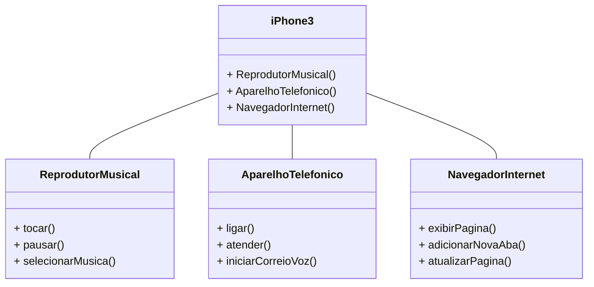

# UML-Iphone
Diagramação de Classes UML do iPhone

### Diagrama de Classes

```mermaid
classDiagram
  class iPhone3 {
    + ReprodutorMusical()
    + AparelhoTelefonico()
    + NavegadorInternet()
  }

  class ReprodutorMusical {
    + tocar()
    + pausar()
    + selecionarMusica()
  }

  class AparelhoTelefonico {
    + ligar()
    + atender()
    + iniciarCorreioVoz()
  }

  class NavegadorInternet {
    + exibirPagina()
    + adicionarNovaAba()
    + atualizarPagina()
  }

  iPhone3 -- ReprodutorMusical
  iPhone3 -- AparelhoTelefonico
  iPhone3 -- NavegadorInternet

```
